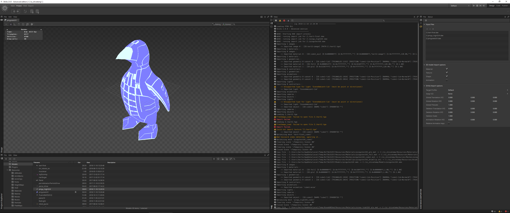

# ShiVa 2.0 DAE mass import panel
Simplifies and speeds up the DAE import process of multiple files.

# Screenshot

# Module installation
For the time being, the module is delivered as separate files. 

## Windows
Copy module/com.tris.daeimport to AppData/Local/ShiVa/Editor/Modules,  
then put the lua52.dll into the ShiVa 2.0 root directory, next to all the Qt libs

## Mac
Copy module/com.tris.daeimport to ~/Library/Application Support/ShiVa/Editor/Modules

## Linux
Copy module/com.tris.daeimport to ~/.shiva/ShiVa/Editor/Modules

